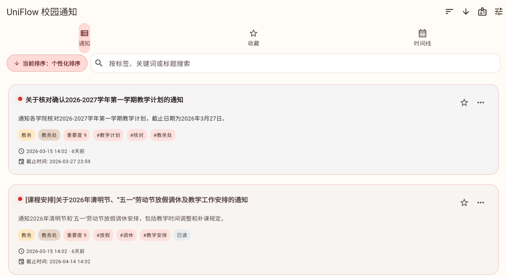
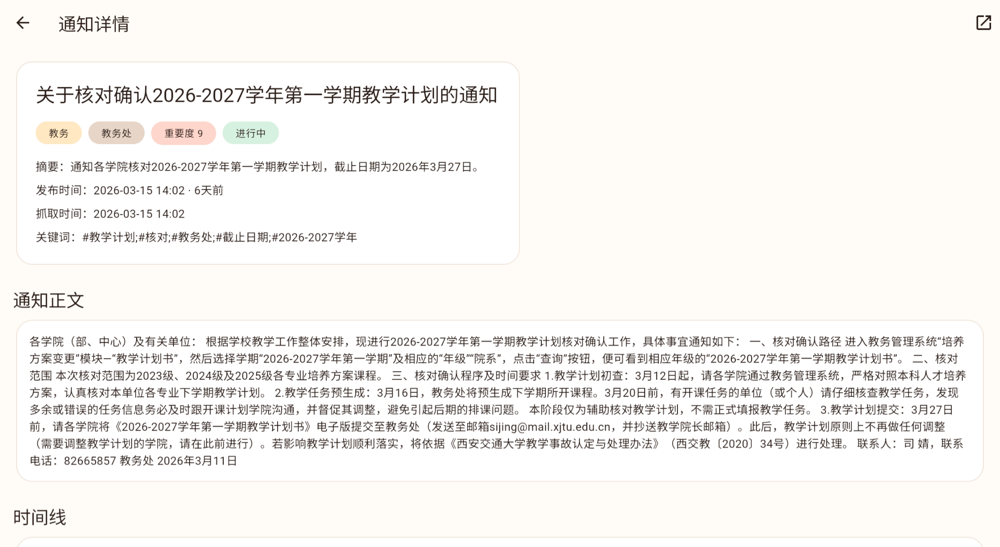
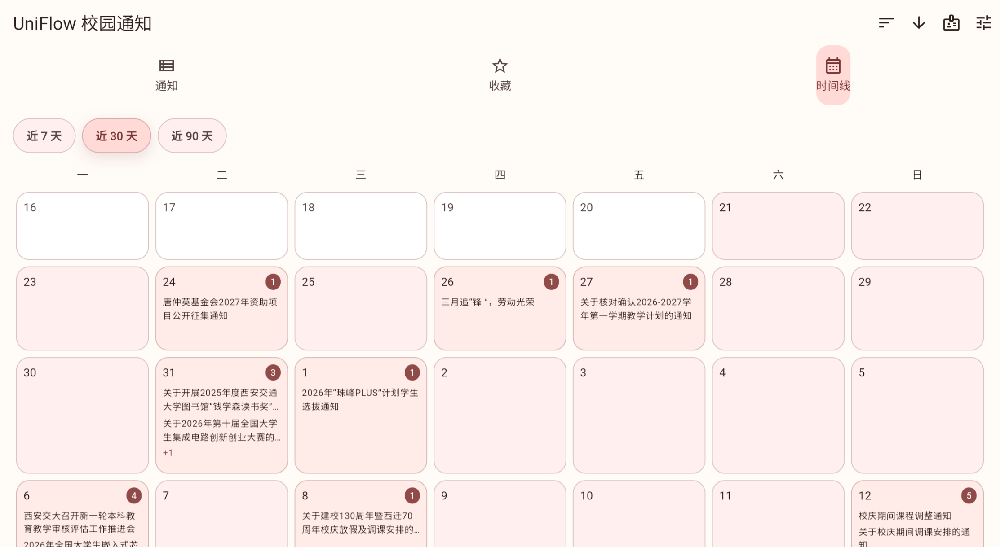
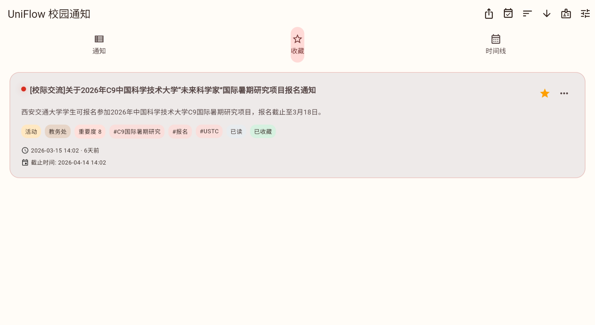

# 🚀 UniFlow — 校内通知时间线统一推流系统

<p align="center">
  
</p>

<p align="center">
  <b>聚合 · 精炼 · 时间线化</b><br/>
  <sub>让校内信息获取更高效</sub>
</p>

<p align="center">
  
  
  
  
  
</p>

---

## ✨ 项目简介

**UniFlow** 是一个面向高校的信息流平台，旨在解决校内通知分散、信息冗余、获取效率低的问题。

通过 **多源抓取 + AI 智能处理 + 时间线化展示**，将分散的通知转化为清晰、结构化的信息流，让用户不错过任何重要信息。

---

## ⚠️ 当前适用范围

> 📌 **本项目当前仅适用于西安交通大学（XJTU）校内信息系统。**

由于不同高校的信息系统结构差异较大，当前数据源与解析逻辑基于 XJTU 定制开发。

👉 **欢迎其他高校或开发者联系进行适配与扩展！**

---

## 🎯 核心亮点

* 📡 **多源统一聚合** — 打破信息孤岛
* 🧠 **AI 智能精炼** — 自动提取关键信息
* 🕒 **时间线视图** — 基于 Deadline 的信息组织
* ⚡ **高效信息获取** — 显著降低信息噪音

---

## 📱 应用截图

<p align="center">
  
  
  
  
</p>

---

## 📦 下载

<p align="center">
  <a href="https://github.com/Jody8888/UniFlow/releases">
    
  </a>
  <a href="https://github.com/Jody8888/UniFlow/releases">
    
  </a>
</p>

---

## 🧠 AI 能力

UniFlow 引入人工智能技术，实现：

* 📥 自动抓取与解析通知
* 🧹 信息去噪与结构化处理
* ✂️ 内容摘要生成
* ⚖️ 基于权重的优先级排序

---

## 🧩 功能一览

### 📄 通知列表

* 个性化排序
* 最新 / 重要 / 截止时间排序
* 🔍 关键词搜索

### 📑 通知详情

* 结构化展示
* 原始来源跳转

### ⭐ 收藏系统

* 收藏重要通知
* 📅 导出 `.ics`
* 📲 导入系统日历（开发中）

### 🕒 时间线

* 基于 Deadline 的可视化
* 关键节点标注

### ⚙️ 个性化设置

* 自定义主题颜色
* 多语言支持
* API / API Key 可配置
* 自动刷新机制

---

## 🏗️ 技术架构

```text id="arch1"
Frontend  → Flutter
Backend   → FastAPI (Python)
Database  → PostgreSQL
Data      → 爬虫 + API 逆向
AI        → 信息精炼与结构化
```

---


## 👥 Contributors

> 成员按 **字母顺序排列（alphabetical order）**，不代表贡献大小或重要性。

### 🧑‍💻 核心成员

| 模块              | 负责人               |
| --------------- | ----------------- |
| 前端（Flutter）     | **Thusci**            |
| 后端（FastAPI）     | **Jody8888**          |
| 爬虫系统            | **Jung233, Jody8888** |
| AI处理            | **Jody8888, Thusci**  |
| 数据库（PostgreSQL） | **Thusci**         |


---

## ☕ 支持项目

如果这个项目对你有帮助，欢迎支持我们 ❤️

### Buy Me a Coffee

👉 [Ko-fi](https://ko-fi.com/thusci)

### 爱发电

👉 [Afadian](https://ifdian.net/a/thusci)


### Patreon

👉 [Patreon](https://www.patreon.com/Thusci)

---

## 🤝 合作与扩展

UniFlow 具备良好的可扩展架构，支持接入不同高校的信息系统。

如果你：

* 🎓 来自其他高校
* 🧑‍💻 想参与开发
* 🏫 希望部署到自己的学校

👉 欢迎通过 Issue 或联系作者进行合作！

---

## 🙏 特别鸣谢

* XJTU ANA 社团
* Silicon Flow
* Google Antigravity
* OpenAI Codex
* Webmin Panel

---

## 📌 Roadmap

* [ ] 日历同步完善
* [ ] 推送通知系统
* [ ] Web 端支持
* [ ] AI 推荐优化
* [ ] 多高校适配支持

---

## 📄 版权声明

Copyright (c) 2026 UniFlow Project Authors

All rights reserved.

本项目及其源代码归作者所有，未经许可不得复制、修改、分发或用于商业用途。

---

## 🌟 Star 趋势

<p align="center">
  
</p>

---

## 🚀 项目愿景

构建一个统一、高效、智能的校内信息流平台，
推动高校信息获取方式的升级。
